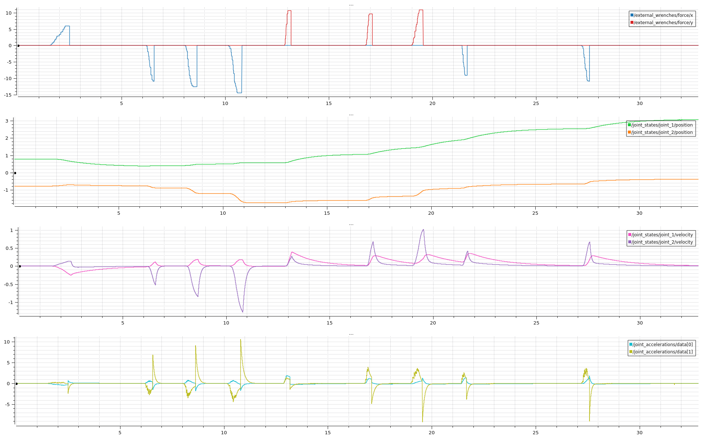
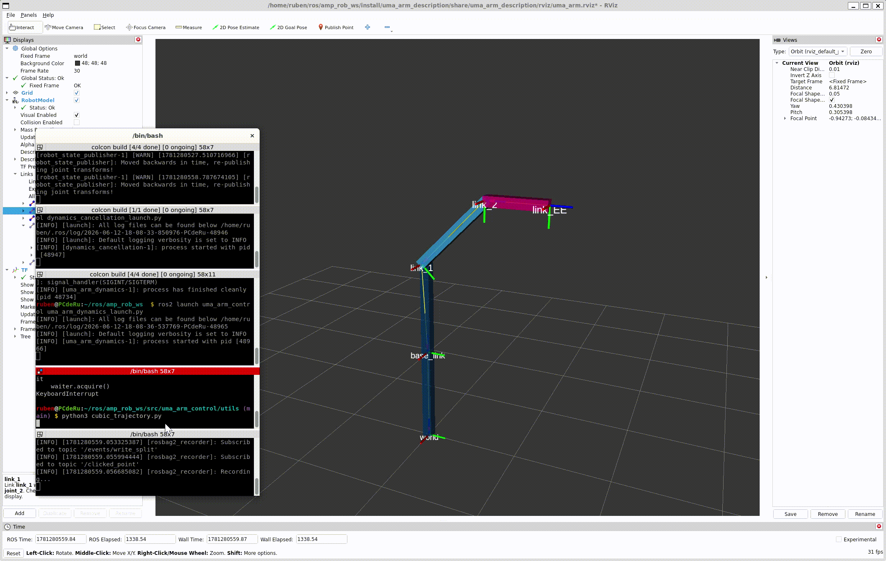
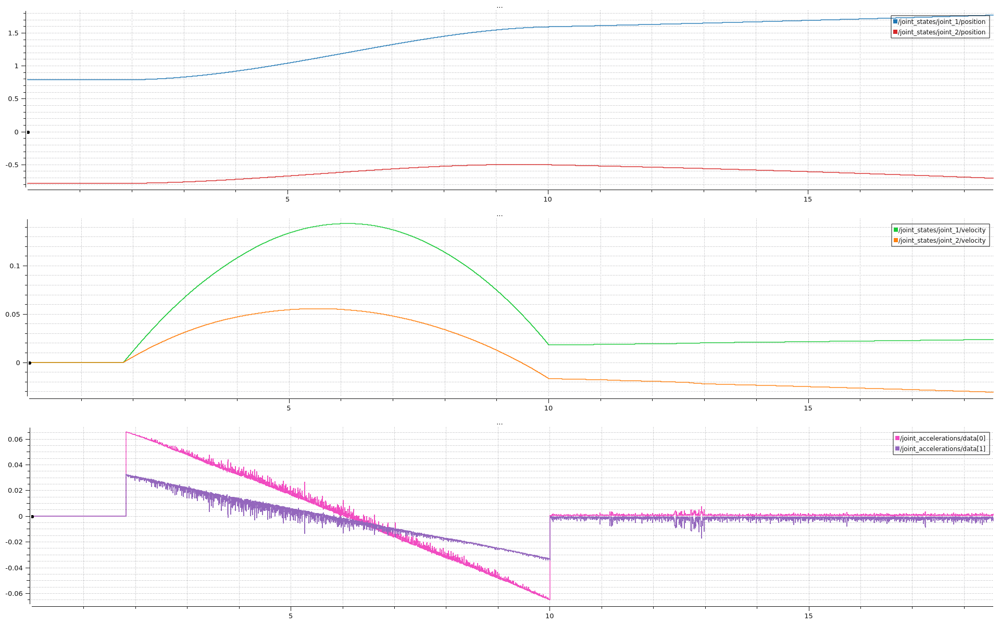
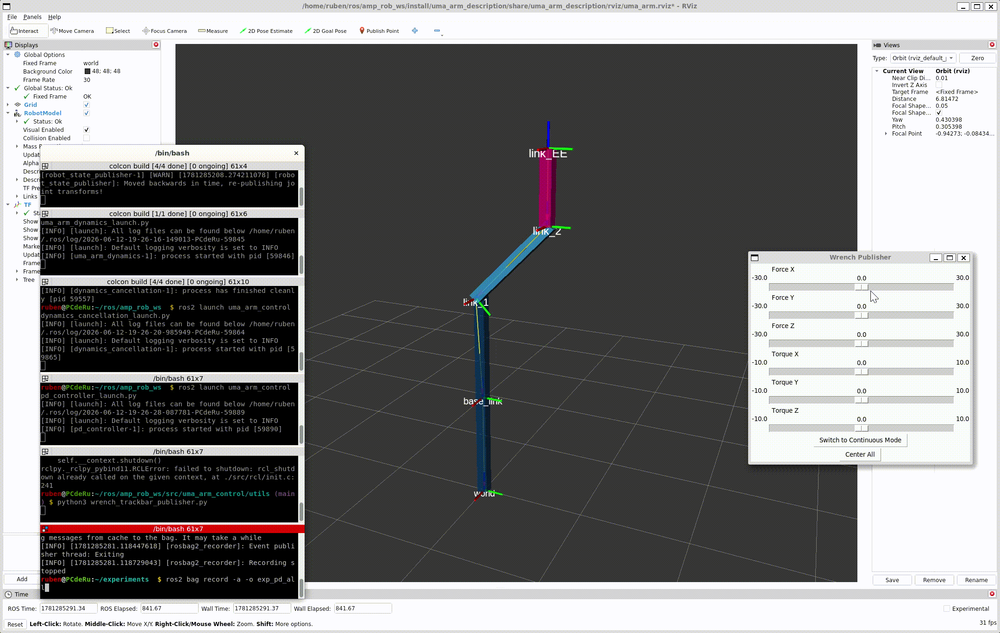
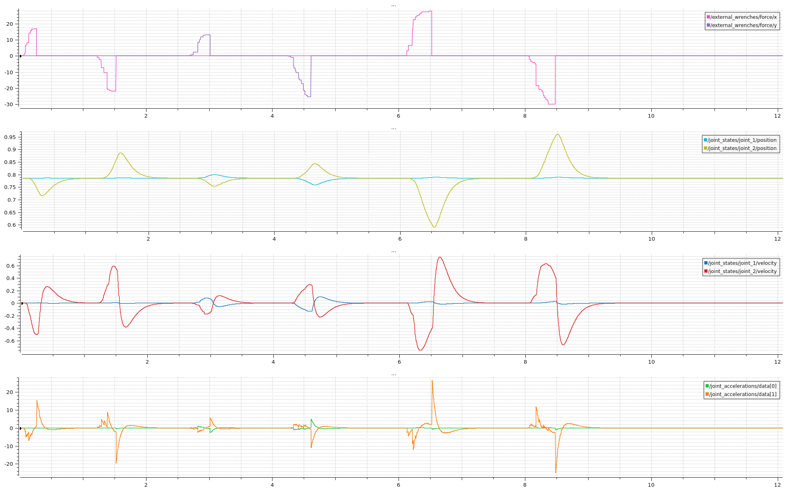

# Lab 3: Inverse Dynamics Control

Este repositorio contiene la implementación en ROS 2 (C++) de estrategias de control centralizado para un brazo manipulador en el espacio articular. Se exploran tres esquemas fundamentales: compensación de gravedad, cancelación de dinámica (linealización exacta) y control Proporcional-Derivativo (PD) estabilizador.

---

## Compilación y Ejecución
Clona este repositorio dentro de la carpeta `src` de tu espacio de trabajo de ROS 2 y compila el paquete:
```bash
cd ~/ros/amp_rob_ws/src
git clone https://github.com/rumonru05-byte/inverse_dynamics_control.git
cd ~/ros/amp_rob_ws
colcon build --packages-select uma_arm_control
source install/setup.bash
```

### Preparación Común
Para cualquiera de los siguientes controladores, es necesario lanzar primero el entorno de simulación y la física del robot. Abre dos terminales y ejecuta:

1. **Visualización en RViz:**
```bash
ros2 launch uma_arm_description uma_arm_visualization.launch.py
```
2. **Dinámica del manipulador (Planta real):**
```bash
ros2 launch uma_arm_control uma_arm_dynamics_launch.py
```

---

### 1. Compensación de Gravedad
Si quieres ver la compensación de gravedad en acción:
1. Lanza el nodo controlador:
```bash
ros2 launch uma_arm_control gravity_compensation_launch.py
```
2. Lanza el publicador de fuerzas externas para comprobar cómo el brazo mantiene su posición frente a perturbaciones:
```bash
python3 wrench_trackbar_publisher.py
```
*(Nota: Asegúrate de ejecutar el script de fuerzas desde la ruta correcta o usar `ros2 run` si está configurado en tu paquete).*

### 2. Cancelación de Dinámica
Si quieres ver la cancelación de la dinámica (linealización exacta):
1. Lanza el nodo controlador (el brazo quedará sin fricción ni gravedad):
```bash
ros2 launch uma_arm_control dynamics_cancellation_launch.py
```
2. Lanza el script de la trayectoria circular para comprobar el seguimiento:
```bash
python3 cubic_trajectory.py
```

### 3. Controlador PD Estabilizador
Si quieres ver el funcionamiento del controlador PD de lazo cerrado:
1. Lanza el nodo de cancelación de dinámica (bucle interno):
```bash
ros2 launch uma_arm_control dynamics_cancellation_launch.py
```
2. Lanza el controlador PD (bucle externo):
```bash
ros2 launch uma_arm_control pd_controller_launch.py
```
3. Lanza el publicador de fuerzas externas para comprobar la robustez y estabilización del sistema ante empujones:
```bash
python3 wrench_trackbar_publisher.py
```

**Modificación del punto de equilibrio:**
Si deseas cambiar la coordenada articular hacia la que el controlador PD estabiliza el robot, debes modificar el parámetro `qd` en el constructor del archivo `pd_controller.cpp`:
```cpp
// Cambia {0.785, 0.785} por las coordenadas deseadas en radianes
this->declare_parameter<std::vector<double>>("qd", {0.785, 0.785}); 
```

---

## Descripción de la Implementación

El proyecto se estructura en tres nodos secuenciales que asumen el control de los pares articulares ($\tau$):

1. **`gravity_compensation.cpp`:** Implementa un controlador estático que calcula e inyecta únicamente el par necesario para vencer el peso de los eslabones, manteniendo el robot en equilibrio sin frenos mecánicos:

$$\tau = g(q)$$

2. **`dynamics_cancellation.cpp`:** Implementa la linealización exacta por realimentación. Lee las aceleraciones deseadas ($\ddot{q}_d$) y el estado actual ($q, \dot{q}$) para anular matemáticamente las inercias, fuerzas centrífugas/Coriolis y la fricción viscosa del sistema real:

$$\tau = M(q)\ddot{q}_d + C(q,\dot{q})\dot{q} + F_b\dot{q} + g(q)$$

3. **`pd_controller.cpp`:** Cierra el lazo de control sobre el sistema ya linealizado. Al asumir que $\dot{q}_d = 0$ y $\ddot{q}_d = 0$ (regulación a un punto fijo), calcula la nueva ley de control de aceleración $y$ usando matrices de ganancias Proporcional ($K_P$) y Derivativa ($K_D$):

$$y = K_P(q_d - q) - K_D\dot{q}$$

&emsp;&emsp;Esta aceleración $y$ se publica en el tópico `desired_joint_accelerations` para alimentar al nodo de cancelación de dinámica.

---

## Resultados y Gráficas

A continuación se analizan los resultados experimentales de cada esquema de control propuesto.

### Compensación de Gravedad
La compensación de gravedad permite al brazo contrarrestar su propio peso. Al aplicar fuerzas externas virtuales, el manipulador se desplaza, pero en el momento en que cesa la fuerza, se establece en un nuevo punto de equilibrio estático en lugar de caer libremente.

<table>
  <tr>
    <td align="center">
      <strong>Funcionamiento de la Compensación de Gravedad</strong><br>
      
    </td>
    <td align="center">
      <strong>Evolución de Estados</strong><br>
      
    </td>
  </tr>
</table>

### Cancelación de Dinámica (Trayectoria)
El esquema de cancelación convierte al robot en un doble integrador ideal. En este modo, al enviarle comandos de aceleración (trayectoria cúbica), el brazo es capaz de trazar geometrías complejas, como una curva en el espacio cartesiano.

<table>
  <tr>
    <td align="center">
      <strong>Seguimiento de Trayectoria Circular</strong><br>
      
    </td>
    <td align="center">
      <strong>Posición y Velocidad Articular</strong><br>
      
    </td>
  </tr>
</table>

### Controlador PD Estabilizador
Al someter la planta linealizada a perturbaciones sin un lazo cerrado, el sistema se vuelve inestable. La integración del controlador PD permite que el robot se comporte como un sistema de segundo orden críticamente amortiguado ($\zeta = 1$). Al aplicar fuerzas, el brazo absorbe la perturbación y regresa asintóticamente a su coordenada original ($[0.785, 0.785]$) sin sobreimpulso ni oscilaciones persistentes.

<table>
  <tr>
    <td align="center">
      <strong>Estabilización PD ante Fuerzas Externas</strong><br>
      
    </td>
    <td align="center">
      <strong>Rechazo de Perturbaciones (Gráfica)</strong><br>
      
    </td>
  </tr>
</table>
